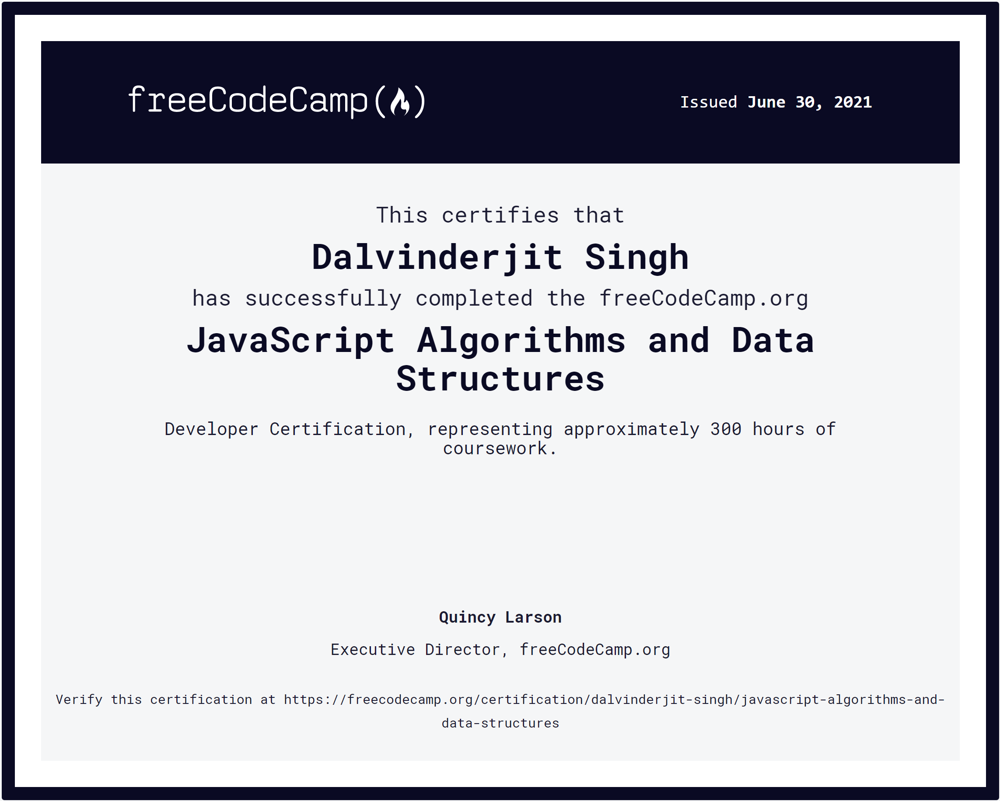

# JavaScript Algorithms and Data Structures Projects

These are my [5 JavaScript projects for the JavaScript Algorithms and Data Structures certification on freeCodeCamp](https://www.freecodecamp.org/learn/javascript-algorithms-and-data-structures/#javascript-algorithms-and-data-structures-projects). freeCodeCamp is a nonprofit community that helps people learn to code by building projects.

## Certificate

## Links

- Certification: [https://www.freecodecamp.org/certification/dalvinderjit-singh/javascript-algorithms-and-data-structures](https://www.freecodecamp.org/certification/dalvinderjit-singh/javascript-algorithms-and-data-structures)
- FCC Profile Page: [https://www.freecodecamp.org/dalvinderjit-singh](https://www.freecodecamp.org/dalvinderjit-singh)
- Live Site: [https://dalvinderjitsingh.github.io/freeCodeCamp-projects](https://dalvinderjitsingh.github.io/freeCodeCamp-projects)
