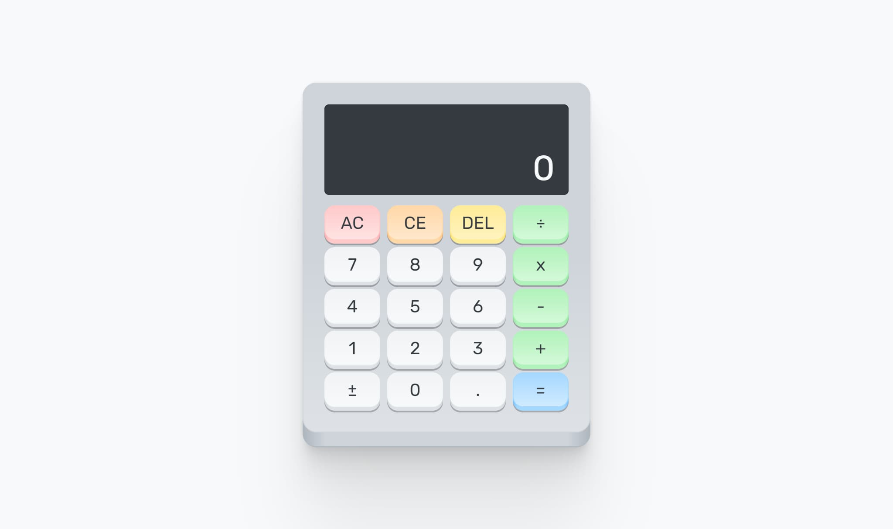

# freeCodeCamp - Calculator

This is a solution to the [Build a JavaScript Calculator](https://www.freecodecamp.org/learn/front-end-development-libraries/front-end-development-libraries-projects/build-a-javascript-calculator) project from [freeCodeCamp](https://www.freecodecamp.org/).

## Table of contents

- [Overview](#overview)
  - [The challenge](#the-challenge)
  - [Screenshot](#screenshot)
  - [Links](#links)
- [My process](#my-process)
  - [Built with](#built-with)
  - [What I learned](#what-i-learned)
- [Author](#author)
- [Acknowledgments](#acknowledgments)

## Overview

### The challenge

Build a JavaScript Calculator.

- Can use any mix of HTML, JavaScript, CSS, Bootstrap, SASS, React, Redux, and jQuery to complete this project.
- Should use a frontend framework (like React for example) because this section is about learning frontend frameworks.

### Screenshot

### Links

- Live Site: [https://dalvinderjitsingh.github.io/calculator](https://dalvinderjitsingh.github.io/calculator)

## My process

### Built with

- HTML, CSS, JavaScript
- [React](https://reactjs.org/)
- [Create React App](https://create-react-app.dev/)
- [Open Props](https://open-props.style/)

### What I learned

While working through this project, I practiced using React and Open Props.

## Author

- Name - Dalvinderjit Singh
- Website - [dalvinderjitsingh.github.io](https://dalvinderjitsingh.github.io/)
- LinkedIn - [Dalvinderjit Singh](https://www.linkedin.com/in/dalvinderjit-singh-a40b511b7/)
- Twitter - [@dalvinderjit01](https://twitter.com/dalvinderjit01)

## Acknowledgments

I want to thank all the people involved in creating and running the freeCodeCamp curriculum and website. This project was a great learning experience. I also want to thank all the people who made the resources utilised in developing this project.
