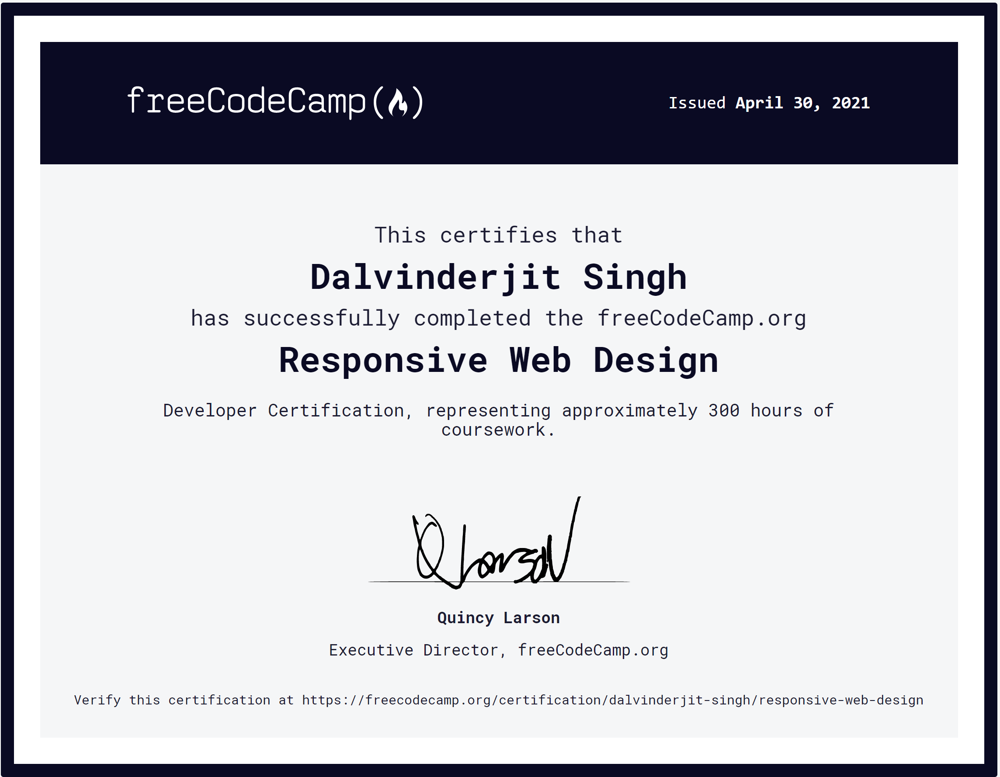

# Responsive Web Design Projects

These are my [5 web programming projects for the Responsive Web Design certification on freeCodeCamp](https://www.freecodecamp.org/learn/responsive-web-design/#responsive-web-design-projects). freeCodeCamp is a nonprofit community that helps people learn to code by building projects.

## Certificate

## Links

- Certification: [https://www.freecodecamp.org/certification/dalvinderjit-singh/responsive-web-design](https://www.freecodecamp.org/certification/dalvinderjit-singh/responsive-web-design)
- FCC Profile Page: [https://www.freecodecamp.org/dalvinderjit-singh](https://www.freecodecamp.org/dalvinderjit-singh)
- Live Site: [https://dalvinderjitsingh.github.io/freeCodeCamp-projects](https://dalvinderjitsingh.github.io/freeCodeCamp-projects)